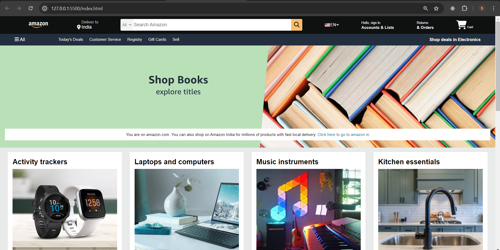

# Amazon Clone

This is a clone of the Amazon website created using HTML and CSS.

## Table of Contents

- [Description](#description)
- [Preview](#preview)
- [Features](#features)
- [Installation](#installation)
- [Usage](#usage)
- [Contributing](#contributing)
- [License](#license)

## Description

This project is a clone of the Amazon website's homepage. It replicates the layout, design, and functionality of the original Amazon page using HTML for structure and CSS for styling.

## Preview



## Features

- Navigation bar with various sections such as logo, search bar, user account, cart, etc.
- Hero section with a message and a link to Amazon India.
- Shop section featuring different product categories with images and "See More" buttons.
- Footer with links to different sections of the website, language and currency options, and legal information.

## Installation

1. Clone the repository:

```bash
git clone https://github.com/your-username/amazon-clone.git
```
## Usage
Open the index.html file in a web browser to view the Amazon clone website.

